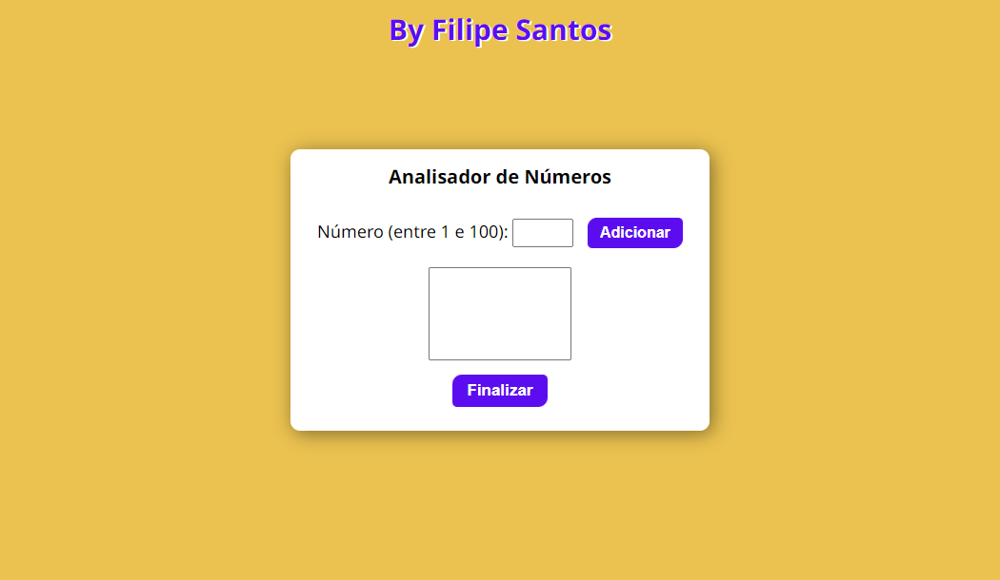

# Analizador de números

> Desafio do Curso de JavaScript

Nesse projeto eu fiz do zero um analizador de números, que foi um dos desafios do curso de javascript do curso em vídeo! Nela você pode adicionar números, e esse número será guardado na memória (array) , e ao clicar em finalizar, o programa fará todo o calculo e mostrará as informações aos usuários, e o javascript segue validando as informações caso seja inserido nenhum valor, ou número que já tenha sido digitado.

[🔗 Clique aqui para acessar](https://filipesantos07.github.io/analizador-de-numeros/)

## 🛠️ Tecnologias

- HTML
- CSS
- JavaScript

## 💛 Contato

outerspaceguy@live.co.uk

